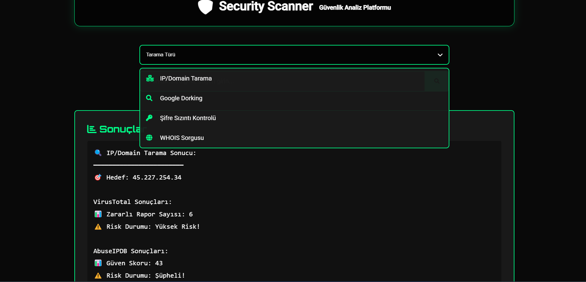
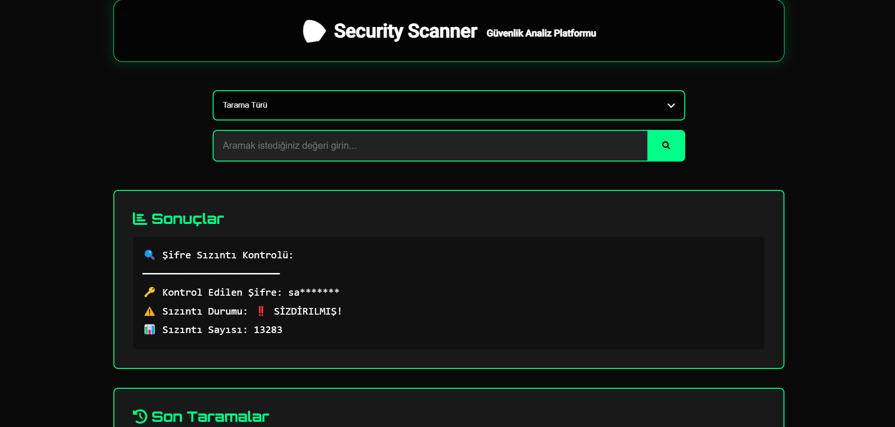
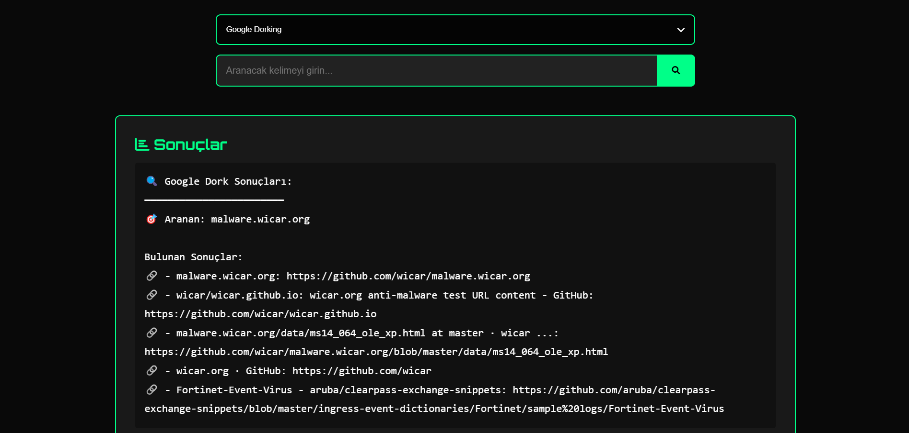
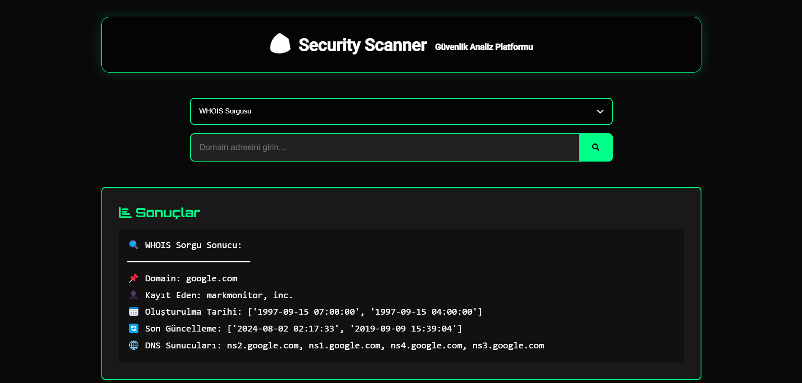
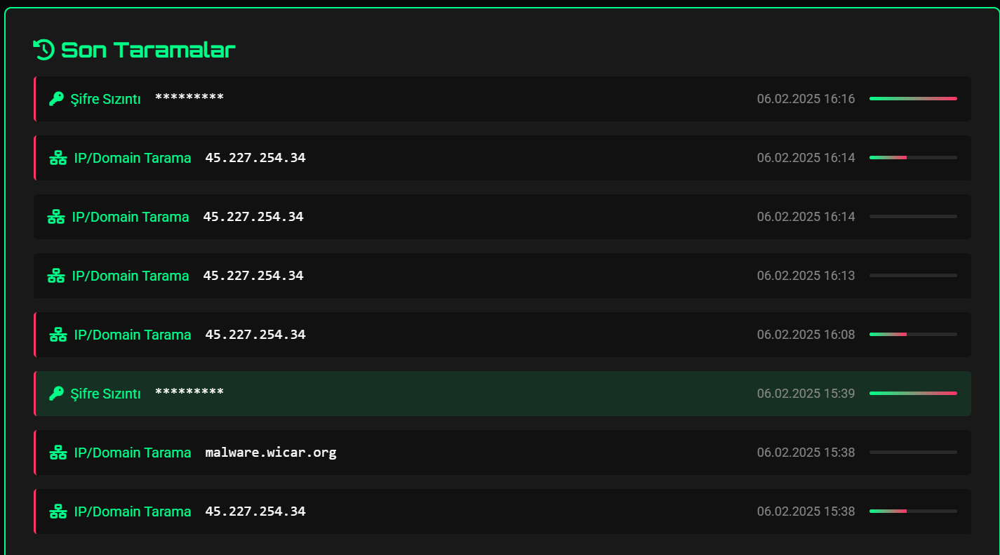
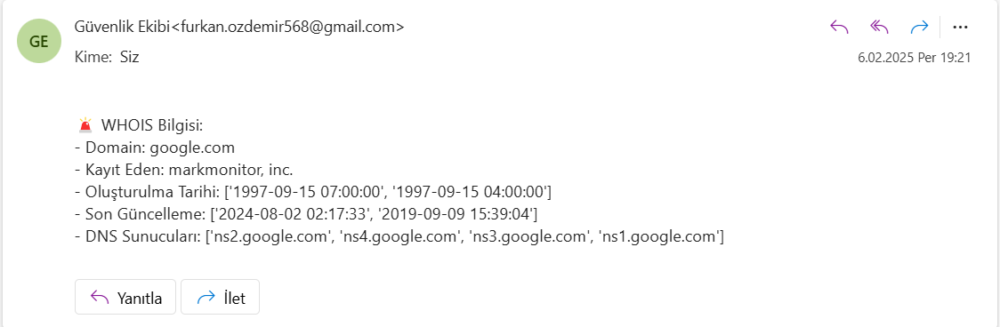
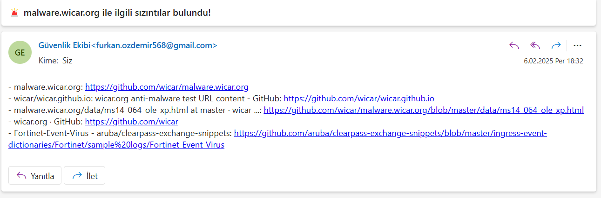

# 🛡️ Security Scanner

Security Scanner, web tabanlı bir güvenlik analiz platformudur. IP/Domain tarama, Google dorking, şifre sızıntı kontrolü ve WHOIS sorgusu gibi temel güvenlik tarama özelliklerini tek bir arayüzde sunar.

## 🚀 Özellikler

- **🌐 IP/Domain Tarama**
  - VirusTotal API entegrasyonu
  - AbuseIPDB risk analizi
  - Tehdit skorlaması ve risk değerlendirmesi
  - Otomatik e-posta bildirimleri

- **🔍 Google Dorking**
  - Hassas bilgi sızıntısı taraması
  - Özelleştirilmiş arama parametreleri
  - Otomatik raporlama
  - Sızıntı tespitinde anlık bildirim

- **🔑 Şifre Sızıntı Kontrolü**
  - Have I Been Pwned API entegrasyonu
  - Güvenli hash kontrolü
  - Sızıntı geçmişi analizi
  - Maskelenmiş şifre gösterimi

- **ℹ️ WHOIS Sorgusu**
  - Domain kayıt bilgileri
  - DNS sunucu bilgileri
  - Kayıt geçmişi analizi
  - Domain yaş kontrolü

## 🛠️ Teknolojiler

- Python 3.9+
- Django 4.x
- SQLite Veritabanı
- AWS SES (E-posta bildirimleri)
- HTML5/CSS3
- JavaScript
- VirusTotal API
- AbuseIPDB API
- Google Custom Search API
- WHOIS API

## ⚙️ Kurulum

1. Repoyu klonlayın:
-bash
-git clone https://github.com/yourusername/security-scanner.git
-cd securityscanner

2. Sanal Ortamı oluşturun:
-bash
-python -m venv venv
-source venv/bin/activate # Linux/Mac için
-venv\Scripts\activate # Windows için

3. Gerekli Kütüphaneleri yükleyin:
-bash
-pip install -r requirements.txt

4. .env dosyasını oluşturun:
- AWS_ACCESS_KEY=your_aws_access_key
- AWS_SECRET_KEY=your_aws_secret_key
- AWS_REGION=your_aws_region
- SES_VERIFIED_EMAIL=your_email@example.com
- VT_API_KEY=your_virustotal_api_key
- ABUSEIPDB_API_KEY=your_abuseipdb_api_key
- GOOGLE_API_KEY=your_google_api_key
- GOOGLE_CX_ID=your_google_cx_id
- WHOIS_API_KEY=your_whois_api_key

5. Veritabanı migration'larını yapın:
-bash
-python manage.py migrate

6. Projeyi çalıştırın:
-bash
-python manage.py runserver

## 📖 Kullanım Kılavuzu

### 🎯 IP/Domain Tarama
1. Tarama türünü "IP/Domain Tarama" olarak seçin
2. IP adresi veya domain adı girin (Örn: 8.8.8.8 veya example.com)
3. Sonuçlarda şu bilgileri göreceksiniz:
   - VirusTotal tehdit skoru
   - AbuseIPDB güvenlik değerlendirmesi
   - Risk durumu ve öneriler

### 🔍 Google Dorking
1. Tarama türünü "Google Dorking" olarak seçin
2. Aramak istediğiniz kelime veya kelime grubunu girin
3. Sistem otomatik olarak:
   - Pastebin
   - Github
   - Diğer veri sızıntı kaynaklarını tarar
   - Bulunan sonuçları listeler

### 🔑 Şifre Sızıntı Kontrolü
1. Tarama türünü "Şifre Sızıntı" olarak seçin
2. Kontrol etmek istediğiniz şifreyi girin
3. Sistem güvenli bir şekilde:
   - Şifreyi hash'leyerek kontrol eder
   - Sızıntı veritabanlarında arar
   - Sızıntı sayısını ve risk durumunu gösterir

### ℹ️ WHOIS Sorgusu
1. Tarama türünü "WHOIS Sorgusu" olarak seçin
2. Domain adını girin (Örn: example.com)
3. Sonuçlarda şu bilgileri göreceksiniz:
   - Domain kayıt bilgileri
   - Oluşturulma/güncellenme tarihleri
   - DNS sunucu bilgileri
   - Domain yaşı ve güvenilirlik analizi

### 📊 Sonuçların Yorumlanması

- **Risk Skoru**
  - 🟢 0-35: Düşük risk
  - 🟡 36-70: Orta risk
  - 🔴 71-100: Yüksek risk

- **Tehdit Durumu**
  - ✅ Güvenli: Herhangi bir tehdit tespit edilmedi
  - ⚠️ Şüpheli: İncelenmesi önerilen durumlar
  - ❌ Tehlikeli: Acil önlem alınması gereken durumlar

## 📸 Ekran Görüntüleri

  
  
<em>IP ve Domain Tarama Sonuçları</em>

  
  
  
<em>Şifre Sızıntı Kontrolü</em>

  
  
  
<em>Google Dork Araması</em>

  
  
  
<em>WHOIS Sorgusu</em>

  
  
  
<em>Son Yapılan Taramalar</em>

  
  
<em>WHOIS Sorgusu Sonrası Gönderilen Mail</em>

  
  
<em>Google Dork Araması Sonrası Gönderilen Mail</em>

## 🔒 Güvenlik

- Tüm API istekleri güvenli HTTPS üzerinden yapılır
- Hassas veriler maskelenir ve şifrelenir
- Rate limiting uygulanır
- IP bazlı erişim kontrolü

## 📧 E-posta Bildirimleri

Platform, aşağıdaki durumlarda otomatik e-posta bildirimleri gönderir:
- Yüksek riskli IP/Domain tespiti
- Şifre sızıntısı tespiti
- Hassas veri sızıntısı tespiti
- WHOIS sorgu sonuçları

## 📝 Lisans

Bu proje [MIT](LICENSE) lisansı altında lisanslanmıştır.

---
⌨️ [Furkan Özdemir] tarafından geliştirilmiştir.

